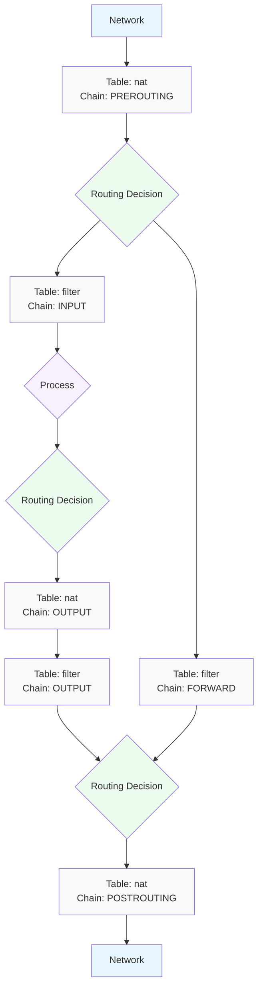

## Networking

- `ip link show ens3` - layer 2 information (MAC)
- `ip addr show ens3` - layer 3 information (MAC & IPs)
- `ip -s link show ens3` - interface statistics (packets sent & received)
- `ip address add 10.0.50.10/24 broadcast 10.0.50.255 dev eth0` - set an interface's IP address
- `ip rule show` - rules point to tables (local → main → default)
- `ip route show table local` - get rules from local table
- `ip route show table main` - get rules from main table
- `ip addr add 10.0.50.10/24 broadcast 10.0.50.255 dev eth0`
- `ip route append 10.0.50.0/24 dev eth0 table main`
- `ip route append default via 10.0.50.254`

```
ip addr add 10.0.50.10/24 broadcast 10.0.50.255 dev eth0
ip route append 10.0.50.0/24 dev eth0
ip addr add 10.0.1.254/24 broadcast 10.0.1.255 dev eth1
ip route append 10.0.1.0/24 dev eth0
ip route append default via 10.0.50.254
ip route show
```

## SELinux

_More help at [CentOS Wiki](https://wiki.centos.org/HowTos/SELinux)._

- **Modes:** Enforcing (default), Permissive (allows all actions, just logs rather than disallowing), Disabled
- **Subjects** - the thing performing an action (processes & users).
- **Access** - the access that is permitted (read, write, append, delete, open, change).
- **Object** - the resource on which the action applies

- `sestatus` - get the current status of SELinux
- `getenforce` - get the current mode of SELinux
- `ls -Z` - get file & folder labels (`<user>:<role>:<type>:<sensitivity>`, e.g. `system_u:object_r,syslogd_exec_t,s0`)
- `ps auxZ` - get process labels
- `sesearch --allow --source syslog_t --target syslog_conf_t --class file` - search for SELinux rules (e.g. allowing a process to access particular files).
- `find /etc -context "*syslog_conf_t*"` - get files/directories by SELinux type
- `sesearch --allow --source syslog_t --class tcp_socket -C --perm name_bind`
- `semanage port -l | grep '...'` - get port rules
- `semanage fcontext --add --type bin_t /root/.*\\.bin` - add file rule
- `semanage boolean --modify --on httpd_tmp_exec` - modify boolean
- `cat /var/log/audit/audit.log | grep type=AVC` - get SELinux access violations

## iptables



- **Actions:** Accept (allow the connection), Drop (drop the connection, like it never happened), Reject (don't allow, send back an error).
- Rules are processed in order.
- If a rule matches, no more rules are processed.

```bash
# Reset chains
iptables -F INPUT
iptables -F OUTPUT
iptables -F FORWARD
# Set default actions
iptables -P INPUT ACCEPT
iptables -P OUTPUT ACCEPT
iptables -P FORWARD DROP

# Only allow one ping per second
iptables -A INPUT -p icmp --icmp-type echo-request -m limit --limit 1/second -j ACCEPT
# Log any other pings
iptables -A INPUT -p icmp --icmp-type echo-request -j LOG
# Drop any other pings
iptables -A INPUT -p icmp --icmp-type echo-request -j DROP

# Accept ongoing connections
iptables -A INPUT -m conntrack --ctstate RELATED,ESTABLISHED -j ACCEPT

# Stop SSH & Telnet connections to other machines on the network
iptables -A INPUT -m conntrack --ctstate NEW -m tcp -p tcp --dport 22 ! -s 10.0.0.0/16 -j ACCEPT
iptables -A INPUT -m conntrack --ctstate NEW -m tcp -p tcp --dport 23 ! -s 10.0.0.0/16 -j ACCEPT

# Drop any other incoming connections
iptables -P INPUT DROP

# Block any traffic to port 80
iptables -A INPUT -i ens3 -p tcp --dport 80 -j DROP

# Block any traffic from a given IP address range
iptables -A INPUT -i ens3 -p tcp -s 20.0.0.0/24 -j DROP

# Reject any traffic after going through the other rules
iptables -A FORWARD -j REJECT
```

```bash
# Reset chains
iptables -F INPUT
iptables -F OUTPUT
iptables -F FORWARD
# Set default actions
iptables -P INPUT ACCEPT
iptables -P OUTPUT ACCEPT
iptables -P FORWARD DROP

# Allow return traffic
iptables -A INPUT -m conntrack --ctstate ESTABLISHED,RELATED -j ACCEPT
iptables -A OUTPUT -m conntrack --ctstate ESTABLISHED,RELATED -j ACCEPT

# Allow ingress telnet traffic from 10.200.0.1???
iptables -A INPUT -m conntrack --ctstate NEW -p tcp --dport 23 ! -s 10.200.0.1 -j REJECT
# iptables -A INPUT -m conntrack --ctstate NEW -p tcp --dport 23 -s 10.200.0.1 -j ACCEPT

# Make sure SSH & Telnet stay working and users on other VMs cannot login
iptables -A INPUT -m conntrack --ctstate NEW -p tcp --dport ssh ! -s 10.0.0.0/16 -j ACCEPT
iptables -A OUTPUT -m conntrack --ctstate ESTABLISHED,RELATED -j ACCEPT

# Allow egress HTTP traffic to 10.200.0.1
iptables -A OUTPUT -m conntrack --ctstate NEW -p tcp --dport 80 -d 10.200.0.1 -j ACCEPT

# Allow related and established traffic in both directions (for a router). Permit http and ping requests to an internet machine at 192.168.1.5 (assuming internet is eth9)
iptables -A FORWARD -m conntrack --ctstate ESTABLISHED,RELATED -j ACCEPT
iptables -A FORWARD -m conntrack --ctstate NEW -p tcp --dport 80 -d 192.168.1.5 -o eth9 -j ACCEPT
iptables -A FORWARD -m conntrack --ctstate NEW -p icmp --icmp-type echo-request -d 192.168.1.5 -o eth9 -j ACCEPT
```